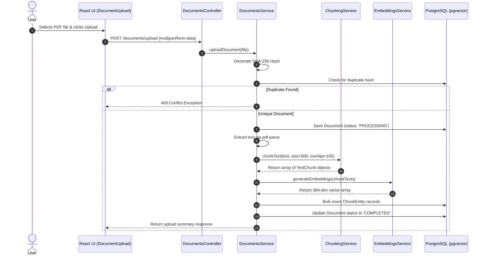
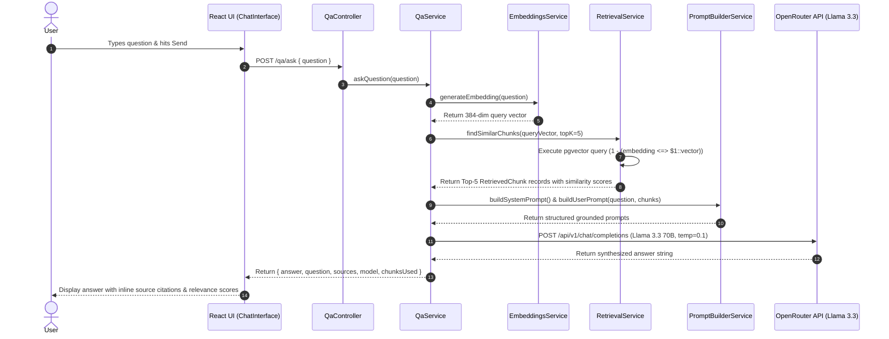
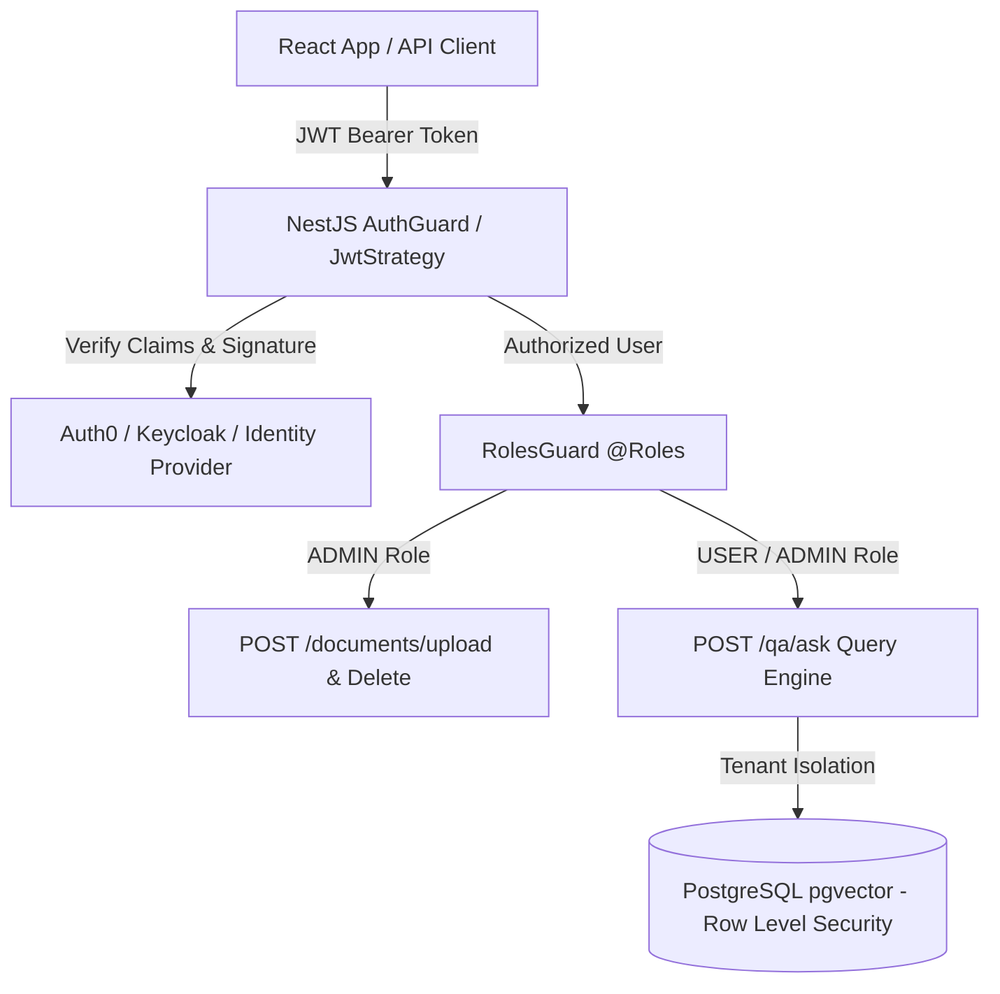

# RAG Chatbot — Comprehensive Codebase Documentation

## 1. Executive Summary & Technology Stack

The **RAG Chatbot** is a production-grade Retrieval-Augmented Generation system designed for uploading PDF documents, parsing and segmenting text into chunks, vectorizing content using local transformer embeddings, and answering user questions using grounded contextual retrieval powered by Llama 3.3 70B.

### Technology Stack Overview
- **Backend Framework**: NestJS (Node.js / TypeScript)
- **Frontend Framework**: React 18 + Vite + TypeScript
- **Database & Vector Store**: PostgreSQL with `pgvector` extension & TypeORM
- **Local Embedding Model**: `@xenova/transformers` running `Xenova/all-MiniLM-L6-v2` (384-dimensional dense vectors)
- **PDF Text Extractor**: `pdf-parse`
- **Large Language Model (LLM)**: Meta Llama 3.3 70B Instruct via OpenRouter API
- **HTTP Client**: Axios

---

## 2. Directory & File Structure

```
wisflux 4th assignment/
├── README.md                      # Quick start guide
├── CODEBASE_DOCUMENTATION.md      # Full architecture & codebase specification
├── .gitignore                     # Workspace root gitignore
├── document-rag/                  # NestJS Backend API Service
│   ├── src/
│   │   ├── main.ts                # Application bootstrap entry point
│   │   ├── app.module.ts          # Central NestJS root module
│   │   ├── app.controller.ts      # Health check controller
│   │   ├── app.service.ts         # App health service
│   │   ├── config/
│   │   │   └── database.config.ts # TypeORM & PostgreSQL configuration
│   │   ├── documents/             # Document ingestion module
│   │   │   ├── document.entity.ts # Document metadata entity (PostgreSQL)
│   │   │   ├── chunk.entity.ts    # Vector chunk entity (pgvector 384-dim)
│   │   │   ├── chunking.service.ts# Sliding-window text chunking algorithm
│   │   │   ├── upload.dto.ts      # DTO validation for document uploads
│   │   │   ├── documents.controller.ts # REST API for file uploads & listings
│   │   │   ├── documents.service.ts    # Ingestion pipeline orchestrator
│   │   │   └── documents.module.ts     # Ingestion module definition
│   │   ├── embeddings/            # Embedding generation module
│   │   │   ├── embeddings.service.ts   # MiniLM Transformer vectorizer
│   │   │   └── embeddings.module.ts    # Embeddings module export
│   │   ├── retrieval/             # Vector similarity search module
│   │   │   ├── retrieval.service.ts    # pgvector raw SQL cosine distance queries
│   │   │   └── retrieval.module.ts     # Retrieval module export
│   │   └── qa/                    # Grounded QA & LLM generation module
│   │       ├── ask-question.dto.ts# DTO validation for questions
│   │       ├── prompt-builder.service.ts # System & user prompt formatting
│   │       ├── qa.controller.ts   # REST API for Q&A query endpoints
│   │       ├── qa.service.ts       # End-to-end RAG Q&A orchestrator
│   │       └── qa.module.ts        # QA module export
│   ├── docker-compose.yml         # PostgreSQL + pgvector container spec
│   ├── package.json               # Backend dependencies and scripts
│   └── tsconfig.json              # TypeScript compiler config
└── document-rag-ui/               # React + Vite Frontend Application
    ├── src/
    │   ├── main.tsx               # React Application root mount point
    │   ├── App.tsx                # Layout shell & view state manager
    │   ├── App.css                # Base application layout styles
    │   ├── index.css              # Global styling & glassmorphism theme
    │   └── components/
    │       ├── DocumentUpload.tsx # Drag & drop PDF uploader component
    │       ├── DocumentList.tsx   # Live list of uploaded documents & statuses
    │       └── ChatInterface.tsx  # Chat Q&A interface with source citations
    ├── package.json               # Frontend dependencies and scripts
    └── vite.config.ts             # Vite build configuration
```

---

## 3. Database Schema & Vector Models

### 3.1 `documents` Table (`DocumentEntity`)
Stores metadata regarding each uploaded document.

| Column | Type | Description |
| :--- | :--- | :--- |
| `id` | `UUID` (PK) | Primary key generated automatically |
| `filename` | `varchar` | Original name of uploaded PDF |
| `hash` | `varchar` (Unique) | SHA-256 hash of file buffer for duplicate prevention |
| `status` | `enum` | Processing state: `'PROCESSING'`, `'COMPLETED'`, `'FAILED'` |
| `createdAt` | `timestamp` | Record creation timestamp |
| `updatedAt` | `timestamp` | Record last update timestamp |

### 3.2 `chunks` Table (`ChunkEntity`)
Stores segmented text blocks along with 384-dimensional vector embeddings.

| Column | Type | Description |
| :--- | :--- | :--- |
| `id` | `UUID` (PK) | Primary key generated automatically |
| `content` | `text` | Segmented text payload |
| `chunkIndex` | `int` | Zero-based index position in original file |
| `metadata` | `jsonb` | Metadata including `startChar`, `endChar`, and `charCount` |
| `embedding` | `vector(384)` | Dense embedding vector generated by MiniLM |
| `documentId` | `UUID` (FK) | Foreign key referencing `documents(id)` (CASCADE delete) |

---

## 4. System Architecture & End-to-End Workflows

### 4.1 Document Ingestion Workflow



### 4.2 Grounded Question Answering (RAG) Workflow



---

## 5. Backend Modules Detailed Explanation

### 5.1 `DocumentsModule` (`src/documents/`)
- **`chunking.service.ts`**: Implements a sliding-window text chunking algorithm (`chunkText`).
  - Target chunk size: 500 characters
  - Overlap size: 100 characters (preserves sentence context across boundaries)
  - Uses sentence-aware boundary snapping (`.`, `?`, `!`, `\n`) to prevent splitting sentences in the middle.
- **`documents.service.ts`**: Controls stages 1 through 10 of document ingestion:
  1. Computes SHA-256 hash.
  2. Verifies uniqueness.
  3. Records document metadata.
  4. Parses raw PDF text.
  5. Segments text into chunks.
  6. Batch generates embeddings.
  7. Saves chunks with vectors into PostgreSQL.
  8. Updates document processing status.

### 5.2 `EmbeddingsModule` (`src/embeddings/`)
- **`embeddings.service.ts`**: Integrates `@xenova/transformers`.
  - Implements `OnModuleInit` lifecycle hook to load `Xenova/all-MiniLM-L6-v2` during application boot.
  - Generates 384-dimensional vector outputs with mean pooling and unit length normalization.
  - Offers single (`generateEmbedding`) and batch (`generateEmbeddings`) transformation functions.

### 5.3 `RetrievalModule` (`src/retrieval/`)
- **`retrieval.service.ts`**: Executes vector similarity search.
  - Runs raw SQL against PostgreSQL using TypeORM `DataSource.query()`.
  - Leverages pgvector's `<=>` cosine distance operator: `1 - (c.embedding <=> $1::vector) AS similarityScore`.
  - Joins `chunks` with `documents` table to attach file citation details.
  - Returns top `K` most relevant text chunks sorted by highest similarity score.

### 5.4 `QaModule` (`src/qa/`)
- **`prompt-builder.service.ts`**: Formats prompts for strict LLM grounding:
  - **System Prompt**: Directs LLM to rely *only* on context and explicitly state when information cannot be found.
  - **User Prompt**: Combines top-K retrieved chunk contents labelled by source document and chunk index alongside the user question.
- **`qa.service.ts`**: Manages the complete Q&A execution lifecycle:
  1. Embeds question.
  2. Retrieves vector chunks.
  3. Formats prompt context.
  4. Calls OpenRouter API with `meta-llama/llama-3.3-70b-instruct` at temperature `0.1`.
  5. Returns structured JSON payload complete with answer and source metadata.

---

## 6. Frontend Components Detailed Explanation

### 6.1 `DocumentUpload.tsx`
- Provides an interactive PDF drag-and-drop interface.
- Validates file type (`application/pdf`).
- Displays upload progress indicator and handles HTTP 409 duplicate file notices gracefully.

### 6.2 `DocumentList.tsx`
- Displays all ingested files.
- Features real-time status badges (`COMPLETED`, `PROCESSING`, `FAILED`).
- Allows users to review uploaded document history and timestamps.

### 6.3 `ChatInterface.tsx`
- Full-featured chat interface for interacting with the RAG backend.
- Displays assistant responses alongside collapsible **Source Citations** detailing document filename, chunk index, and similarity match percentage.
- Includes quick-prompt suggestions and error feedback handlers.

---

## 7. REST API Endpoint Reference

### Documents API
- `POST /documents/upload`
  - **Content-Type**: `multipart/form-data`
  - **Body**: `file` (PDF file)
  - **Response**: `{ success: boolean, documentId: string, filename: string, chunksCreated: number }`
- `GET /documents`
  - **Response**: `{ count: number, documents: Array<{ id, filename, status, createdAt }> }`
- `GET /documents/:id`
  - **Response**: `{ id, filename, status, chunkCount, createdAt }`

### Q&A API
- `POST /qa/ask`
  - **Content-Type**: `application/json`
  - **Body**: `{ "question": "What is the document about?" }`
  - **Response**:
    ```json
    {
      "answer": "The document describes...",
      "question": "What is the document about?",
      "sources": [
        {
          "filename": "sample.pdf",
          "chunkIndex": 0,
          "similarityScore": 92.45
        }
      ],
      "model": "meta-llama/llama-3.3-70b-instruct",
      "chunksUsed": 5
    }
    ```

---

## 8. Authentication & Authorization (A&A)

### 8.1 Current Security Model
- **API Access**: In the current development implementation, backend REST endpoints (`/documents`, `/qa/ask`) are unauthenticated to allow quick local prototyping.
- **Third-Party Service Credentials**: Outbound integration with OpenRouter API is authenticated using server-side Bearer Tokens (`OPENROUTER_API_KEY`) isolated inside system environment variables (`.env`), ensuring no client-side API key leakage.

### 8.2 Production Authentication & Authorization (A&A) Specification
For enterprise deployment, the following A&A framework should be enabled:



1. **Authentication (AuthN)**:
   - Integration with `@nestjs/passport` and `passport-jwt`.
   - Bearer token authentication header (`Authorization: Bearer <token>`) required on all REST endpoints.
   - Identity provider integration via OAuth2 / OIDC (Auth0, Keycloak, or Firebase Auth).
2. **Authorization (AuthZ) & Access Control**:
   - **Role-Based Access Control (RBAC)**:
     - `@Roles('ADMIN')`: Granted access to upload documents, clear vector indexes, and manage document lifecycles.
     - `@Roles('USER')`: Granted read-only permission to query vector store via `/qa/ask`.
   - **Multi-Tenant Data Isolation (Row-Level Security)**:
     - Addition of `tenantId` / `userId` columns to `DocumentEntity` and `ChunkEntity`.
     - Retrieval query filtering: `WHERE c.tenantId = :tenantId` to strictly restrict similarity search results to documents owned by the calling tenant.
3. **API Rate Limiting & Denial of Service Protection**:
   - Implemented via `@nestjs/throttler` to prevent abuse of computationally expensive vector searches and third-party LLM token consumption.

---

## 9. Architectural Assumptions & Analysis (A&A)

### 9.1 Technical Assumptions
1. **Document Format & Digital Text Integrity**: Assumes uploaded PDF files contain digital selectable text rather than pure scanned images (OCR processing is not active in the base ingestion pipeline).
2. **Vector Space Uniformity**: Assumes all document chunk vectors and user query vectors are embedded using the exact same transformer model (`Xenova/all-MiniLM-L6-v2`) to ensure valid vector space comparison.
3. **Database Extension Availability**: Assumes PostgreSQL instance has the `pgvector` extension installed (`CREATE EXTENSION IF NOT EXISTS vector;`).

### 9.2 Critical Engineering Analysis

| Component | Design Choice | Tradeoff / Analysis | Mitigation / Recommendation |
| :--- | :--- | :--- | :--- |
| **Embeddings** | Local `all-MiniLM-L6-v2` (384-dim) | Zero API cost & zero network latency for vector generation, but smaller model capacity compared to OpenAI `text-embedding-3-large`. | Upgrade to 1536-dim embeddings if hyper-dense domain terminology is required. |
| **Vector Indexing** | Exact Cosine Similarity (`<=>` operator) | 100% search accuracy for small to medium document collections (< 100,000 chunks). | Add `HNSW` or `IVFFlat` indexes in `pgvector` when chunk count exceeds 500,000. |
| **Chunking Window** | 500 Chars / 100 Overlap | Retains sentence-level granularity; fits nicely into LLM prompt context window. | Works well for general narrative text; structured table parsing requires specialized Markdown splitters. |
| **LLM Selection** | Llama 3.3 70B via OpenRouter | High accuracy, state-of-the-art reasoning, cost-effective API pricing via OpenRouter. | Low temperature (`0.1`) ensures deterministic factual responses with minimal hallucination risk. |

---

## 10. Environment Setup & Configuration

### Required Environment Variables (`document-rag/.env`)
```env
DB_HOST=localhost
DB_PORT=5432
DB_USER=postgres
DB_PASSWORD=postgres
DB_NAME=document_rag
OPENROUTER_API_KEY=your_openrouter_api_key_here
```

### Database Setup with Docker
```bash
cd document-rag
docker-compose up -d
```

### Running Backend
```bash
cd document-rag
npm install
npm run start:dev
```

### Running Frontend
```bash
cd document-rag-ui
npm install
npm run dev
```
